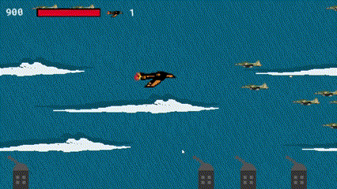

# Sky in Flames
Sky In Flames é um jogo em estilo arcade shoot em up, com objetivo em aéreo de inimigos e territórios, no qual o jogar é representado por uma aeronave de combate, e possui um objetivo de combater o território inimigo e enfrentar o líder boss da força aérea. 
Sky In Flames foi desenvolvido com uma mecânica de combate baseada em jogos de fliperama e modelos 2D de jogos antigos. Ao redor de elementos dos anos 80 e 90, foi desenvonvido cenários e desgners feitos modelo de pixel art.
Ele Foi todo programado utilizando o Game Maker Studio 2.
Jogo feito para apresentação no CAT FAM na [FAM](https://www.vemprafam.com.br) em 2023.

## Como Jogar
Voce pode controlar o avião nas setas e atirar no espaço.

Se tiver o opera gx baixado basta entra nesste [link](https://gx.games/pt-br/games/e8fwty/sky-in-flames/) e começar a jogar.

Caso não tenha pode baixar o [jogo](https://github.com/Sena-ops/Sky-in-Flames/releases/download/untagged-e3a0b9cd4cd966bae231/sky_in_flames_1.0.zip).

## Autores
- [Raphael Sena](https://github.com/Sena-ops) (Programmer)
- [Bruna Foncesa](https://github.com/Bum4n3d) (Artist)

## License
[MIT](https://github.com/Sena-ops/Sky-in-Flames/blob/main/LICENSE)
